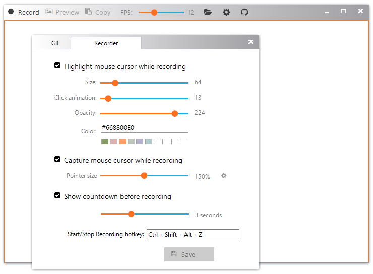

<h1> Gif123 </h1>  

English | [简体中文](./README.md)

Record an area of your desktop to a GIF, and copy it directly to the clipboard.  
[The executable file](https://gif123.aardio.com/download/Gif123.7z) size is 780 KMB only.  
  
This utility works on any version of Windows, starting from Windows XP and up to Windows 11. Both 32-bit and 64-bit systems are supported.

# License

 Licensed under either of [MIT License](./LICENSE) or [GPL 2.0](LICENSE-GPL) at your option.
