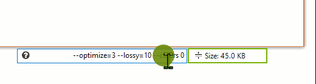

<h1> Gif123 </h1>  

English | [简体中文](./README.md)

Record an area of your desktop to a GIF, easily copy and paste it wherever you want.  
[The executable file](https://gif123.aardio.com/download/Gif123.7z) size is 755 KMB only. This utility works on any version of Windows, starting from Windows XP and up to Windows 11. Both 32-bit and 64-bit systems are supported.

Highlight mouse cursor and show click animation:

Select the area of the screen you want to record:

Edit frames while the preview is paused:

Drag and drop images to Gif123:

The GIF can be re-optimize in preview mode, you can adjust the option numbers by scrolling with mouse wheel.

# License

 Licensed under either of [MIT License](./LICENSE) or [GPL 2.0](LICENSE-GPL) at your option.
