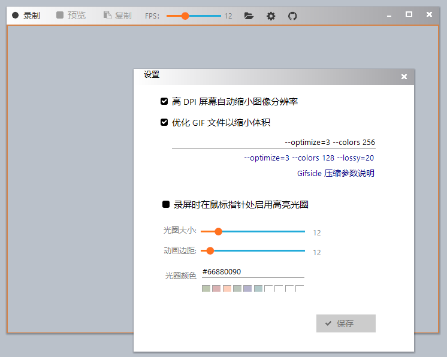
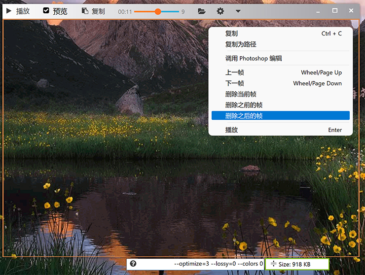
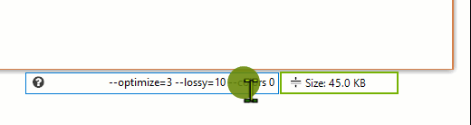

<h1> Gif123 </h1>  

[English](./README.en_US.md) | 简体中文

极简 GIF 录屏工具，可快速复制 GIF 图像并粘贴到其他程序。   
本软件复制的 GIF 文件可直接粘贴到 QQ、浏览器编辑器（支持公众号、头条编辑器），不会出现无法预览、无效图像等问题。  

[> 常见问题解答](#常见问题解答)

[> 执行文件](https://gif123.aardio.com/download/Gif123.7z) 仅 755 KB 。 兼容 XP，Vista，Win7，Win8，Win10，Win11...... 等所有流行桌面操作系统。 

高亮鼠标指针 / 鼠标点击动画:

切换到预览模式且暂停后可编辑动画帧:

预览模式下可以重新优化 GIF 文件，可使用鼠标滚轮快速调整优化选项中的数值。  

# 常见问题解答

1、为什么不在 EXE 目录写一大堆配置文件、临时文件。

现在独立 EXE 已经越来越流行了。Gif123 也是独立 EXE 文件，不会拖家带小，不会在 EXE 目录写一大堆配置文件、临时文件( 这会带来潜在风险与混乱，参考我之前写的文章 )。

2、为什么没有后期编辑功能

Gif123 是极简录屏软件，做减法不做加法。  
如果您希望有更高级更复杂更强大的功能，这边建议您改用视频录屏软件，很多视频编辑软件也支持导入导出 GIF 动画。

3、为什么没有全屏功能

GIF 录屏软件基本都没有这功能，全屏动画用 GIF 格式是不现实的。GIF 的适合小、轻、快，适合时间短、画面小、需要嵌入其他页面，打开就自动循环播放的动画。高画质、大画面、时间长的动画请改用视频录屏软件。

4、为什么没有暂停功能

GIF 动画时间很短，甚至时长只有几秒，玩暂停这些 —— 不必要地整复杂了。Gif123 是极简录屏软件，如果有复杂化的需求，建议改用视频录屏软件。

5、为什么觉得压缩率不理想

GIF 压缩是调用强悍的 Gifsicle，压缩效果无疑是最棒的。  
不同画画内容 —— 最佳压缩参数可能是不一样的，Gif123 可以一边调整压缩参数，一边预览压缩效果，压缩选项也比较多，也更容易获到理想的效果。

之前有用户向我反馈：他说使用某软件录制的 GIF体积比 Gif123 小。

然后我问他要到了他实际录制的 GIF，看了一下。他用 Gif123 录屏时不停切换窗口，而用其他录屏软件时屏幕基本是静止的，实际上这个他用其他软件输出的 GIF，拖进 Gif123 压缩一下，体积小了 10 倍。

所以在对比压缩率与画质时，请注意不要做这种片面的比较。

# 开源许可

本项目使用  [MIT License](./LICENSE) 或 [GPL 2.0](LICENSE-GPL) 开源许可证。

