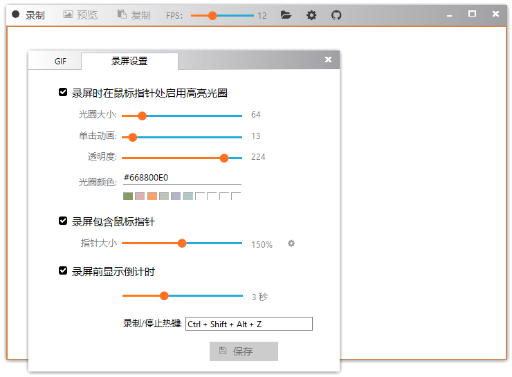

<h1> Gif123 </h1>  

[English](./README.en_US.md) | 简体中文 

极简 GIF 录屏工具，可一键快速复制 GIF 图像并直接粘贴到其他程序。  
支持粘贴到本地文件、QQ、微信、[Word](#word)、浏览器编辑器（支持公众号、头条编辑器）。可避免无法预览、无效图像、变静态图等常见的兼容问题。

原来在公众号编辑器里写文章，可能需要录屏->压缩->保存->添加图像->上传->插入文章 …… 现在用 Gif123 只要 Ctrl +Ｖ 一下就全部完成了。 

[> 下载 Gif123( v3.3 )](https://gif123.aardio.com/download/Gif123.7z) 仅 808 KB 。 兼容 XP，Vista，Win7，Win8，Win10，Win11...... 等所有流行桌面操作系统。 

[> 常见问题解答](#常见问题解答)

高亮鼠标指针 / 鼠标点击动画:

切换到预览模式且暂停后可编辑动画帧:

预览模式下可以重新优化 GIF 文件，可使用鼠标滚轮快速调整优化选项中的数值。  

# 开源许可

本项目使用  [MIT License](./LICENSE) 或 [GPL 2.0](LICENSE-GPL) 开源许可证。

# 常见问题解答

1、为什么没有后期编辑功能

Gif123 是极简录屏软件，做减法不做加法。
如果您希望有更高级更复杂更强大的功能，这边建议您改用视频录屏软件，很多视频编辑软件也支持导入导出 GIF 动画。

2、为什么没有全屏功能

GIF 录屏软件基本都没有这功能，全屏动画用 GIF 格式是不现实的。GIF 适合小、轻、快，时间短、画面小、需要嵌入其他页面，打开就自动循环播放的动画。高画质、大画面、时间长的动画请改用视频录屏软件。

3、Word 选择性粘贴 GIF 动画

首先在 Gif123 内复制 GIF。  
然后点选 Word 工具栏『开始 / 粘贴 / 选择性粘贴』（ Ctrl + Alt + V ）。  
在弹出的『选择性粘贴』界面，选择中间第二个存储 GIF 动态图的『文件』，然后点『确定』。  

Word 用默认的 *.docx 格式支持 GIF 动图。